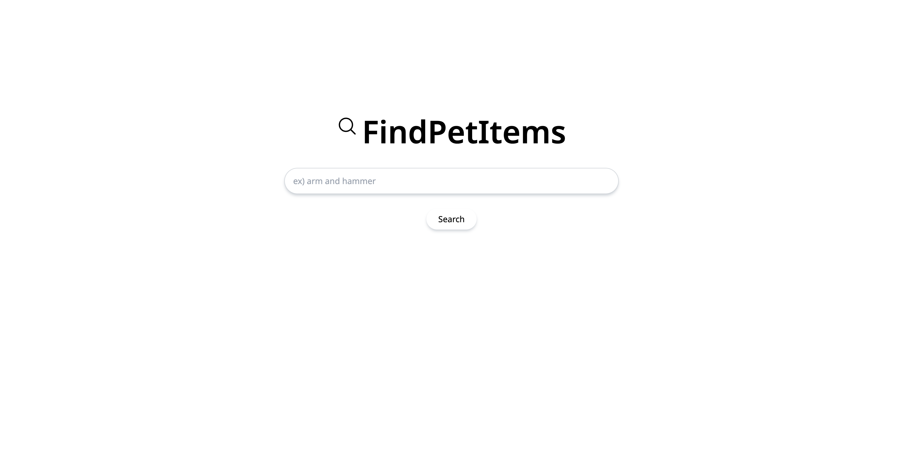
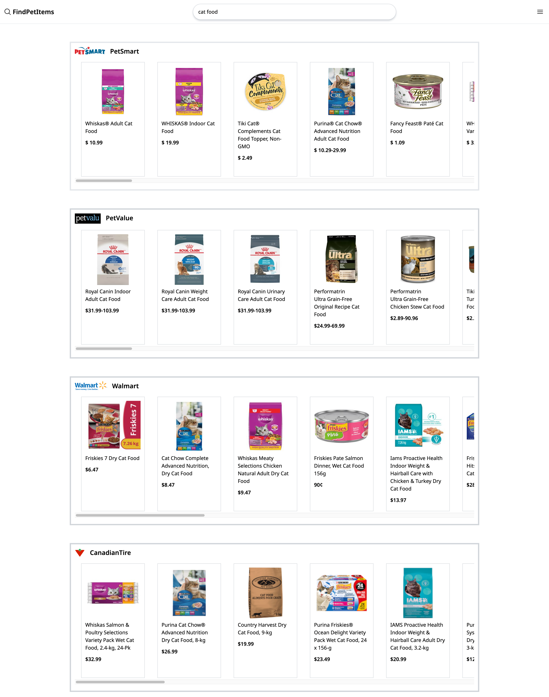
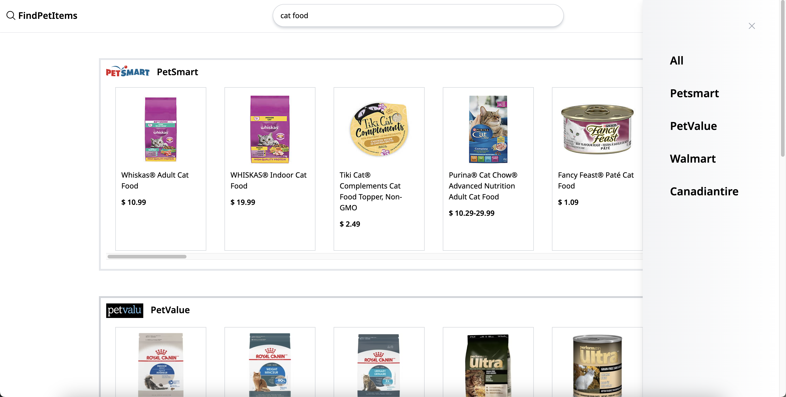

# Pet-Item-Price-scraping

## What is project is it?

> This web application is scraping item price on Petsmart, Petvalu, Walmart and canadiantire web sites using Selenium and Puppeteer library.

##Languages

##Functionality

  ### Search item

      

  ### Total results

        

  ### Menu

        

  ### Single store items

          

